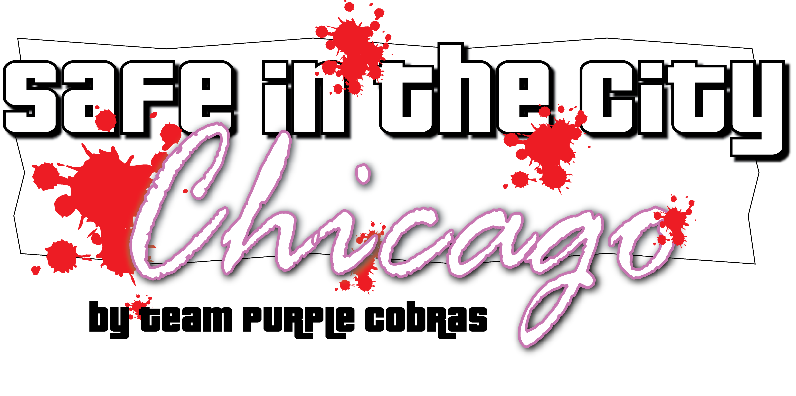
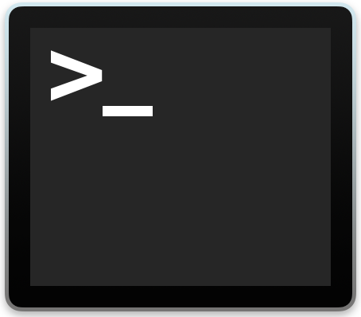
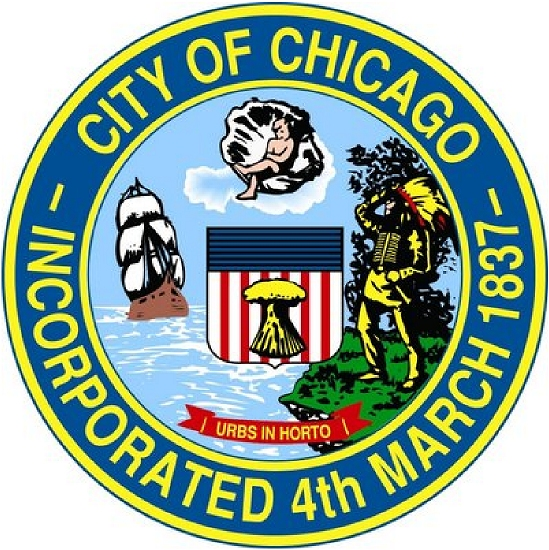
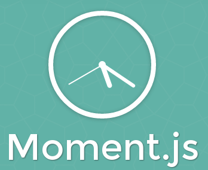

<!--# Domisssile--> 
<p align="center">
	 
</p>
In this project we created a web application that receives an address in Chicago from the user and searches for crime incidents and marks them on the map. It also lists all the crime incidents in the area and saves previous searches.

## Getting Started

You can access the application <a href="https://team-purple-cobras.github.io/isitsafe/" target="_blank">here</a>. Enter your desired address in the search box, Google will automatically complete the address. Click the search button. The page will center and zoom in the map, marking all the crimes within 50 meters radius in the area. Hover over the markers to find more information about the crime such as, description, block and date of the crime incident. You can select the 'Street View' to look and move around for better visualization of the incidents. To see the complete results list, click on the 'View Results List' button on the page. The application will also save the last three searches, you can see the previous searches by clicking on the 'Previous Searches' button.

## What's included

Within the project folder you can find the following directories and files. You'll see something like this:

```
isitsafe/
├── assets/
│   ├── js/
│   │   ├── crime-api.js
│   │   └── google-map-api.js
│   └── icons/
│   │   └── assault.png
│   │   └── battery.png
│   │   └── homicide.png
│   │   └── misc.png
│   │   └── narcotics.png
│   │   └── theft.png
│   └── css/
│       ├── reset.css
│       └── style.css
├── index.html
├── test.html
├── README.md
└── readme
 	└── css.png
 	└── html.png
	└── js.png
	└── git.png
	└── firebase.png
	└── terminal.png
	└── chicagoapi.png
	└── mapsapi.png
	└── logo.png
```

## Contributing

Please feel free to submit pull requests to us for development. The following instructions will get you a copy of the project up and running on your local machine for development and testing purposes.

### Prerequisites

You need the following software for development:

- Source code editor like Atom or Sublime Text
- Git source control manager
- Command line interface
- Web browser (Microsoft Edge, Firefox, Chrome and Safari supported)

### Cloning Repository

Start by opening the command line and downloading the repository as follows

```bash
git clone https://github.com/Team-Purple-Cobras/isitsafe.git
```

change the directory to the project folder and the desired source file (HTML, CSS, JS)

```bash
cd ./isitsafe/
```

open the source files in a source code editor

```bash
open -a "Sublime Text" file-name
```

## Built With

* HTML 
* CSS 
* JS 
* Firebase 
* Git 
* Command Line Interface 

## APIs
<p>
 
<b>Google Maps API:</b> https://developers.google.com/maps/
</p>
<p>

<b>Chicago Crime API:</b> http://api1.chicagopolice.org/clearpath/
</p>
## Libraries used:



## Team 
The list of people who participated in this project.

* **Paige** - [sk8asd123@gmail.com](sk8asd123@gmail.com)
* **Brian** - [brianhagy@gmail.com](brianhagy@gmail.com)
* **Kiwon** - [kiwonnam2016@u.northwestern.edu](kiwonnam2016@u.northwestern.edu)
* **Babak** - [babakshahian2022@u.northwestern.edu](shahianb@gmail.com)

<!--## Acknowledgments

* Hat tip to anyone who's code was used
* Inspiration
* etc-->

